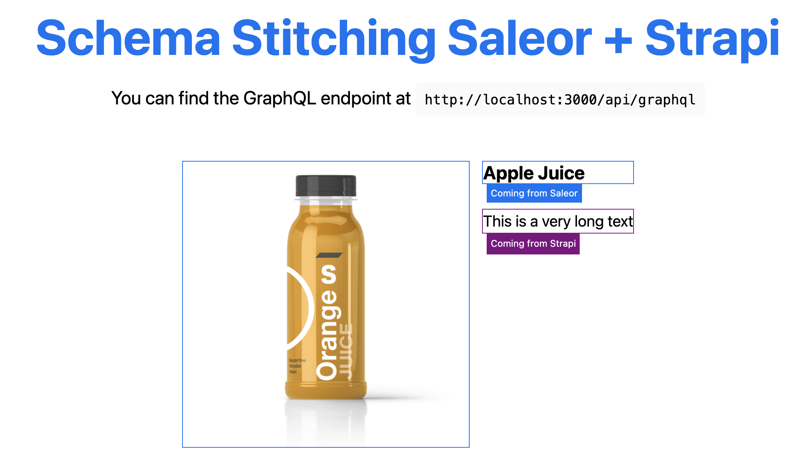

# Schema stitching with Saleor and Strapi

The code in this project shows how you can do schema stitching between two headless architectures: [Saleor](https://saleor.io/) and [Strapi](https://strapi.io/).



## Getting Started

This project consists of a "client" set up with Next.js and uses headless GraphQL APIs from Saleor and Strapi. Copy the file `.env.sample` to a new file called `.env` and add the GraphQL endpoints of these projects to it.

Make sure to add the model `Products` to Strapi, and add the following fields: `title`, `description` and `saleorId`. This last one is added to make the connection with Saleor. After adding the model, make it public and add some sample data - including a working reference to an ID in Saleor.

You can then start the project with:

```bash
npm run dev
# or
yarn dev
```

Open [http://localhost:3000](http://localhost:3000) with your browser to see the application, and [http://localhost:3000/api/graphql](http://localhost:3000/api/graphql) to see the GraphQL server with the combined schemas from Saleor and Strapi. 

## Example query

With the query below you can get the product information from Saleor, and stitch information from Strapi under the field `cmsMetaData`:

```graphql
query {
  # Query.product from Saleor
  product(id: "UHJvZHVjdDo3Mg==") {
    id
    name
    images {
      url
      alt
    }
    # Query.product from Strapi
    cmsMetaData {
      title
      description
      saleorId
    }
  }
}
```
