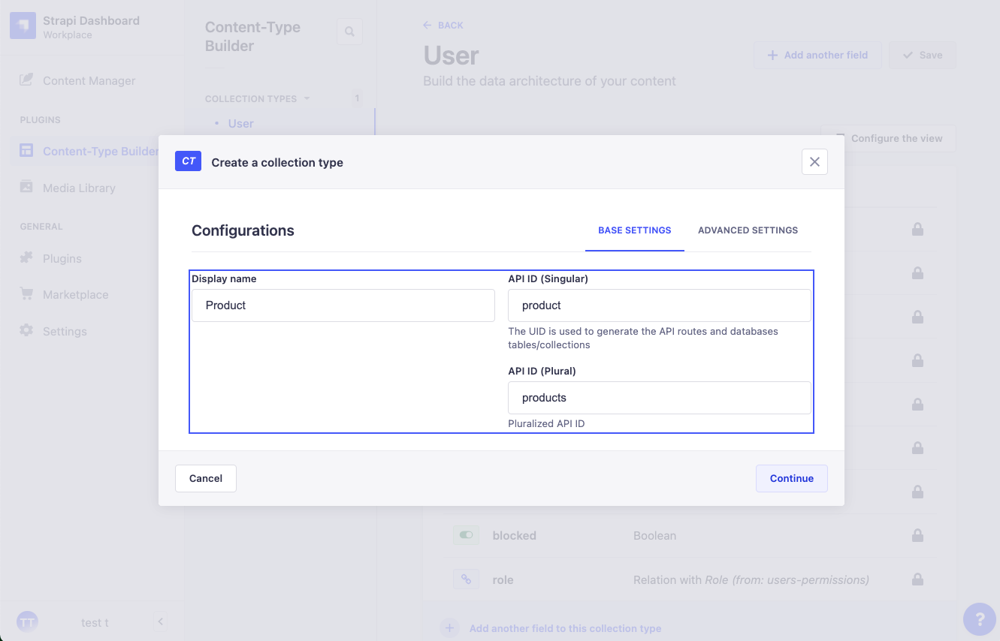
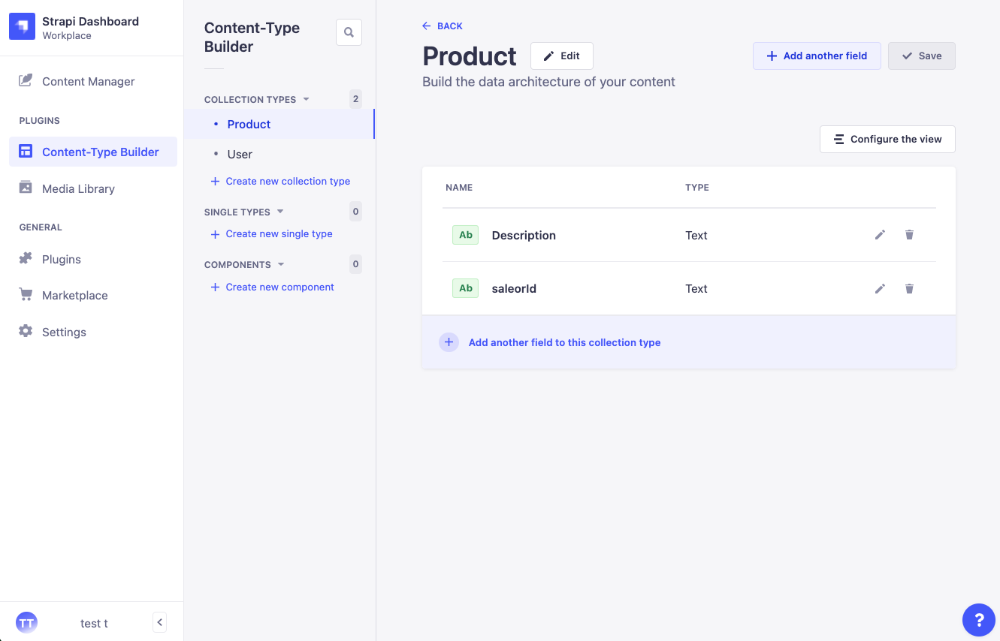
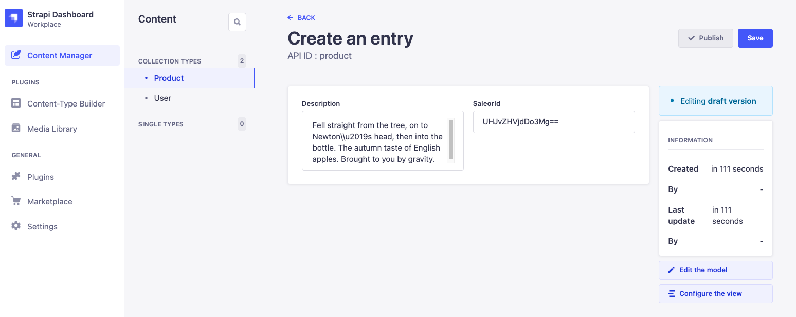
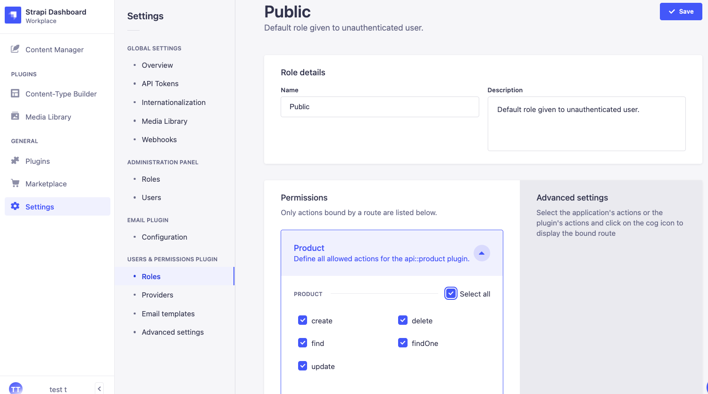

# Schema stitching with Saleor and Strapi

The code in this project shows how you can do schema stitching between two headless architectures: [Saleor](https://saleor.io/) and [Strapi](https://strapi.io/).

## Getting Started

### Set up Strapi

Install Strapi into this project by running `npx create-strapi-app@latest strapi --quickstart` from the project's root. Also, install the GraphQL plugin in this new directory:

```
cd strapi
npm run strapi install graphql
```

Create a new collection called `Product`:



To this collection, you need to add the fields `description` and `saleorId` (both lowercase and type string):



Make sure to add "Save" after adding the fields.

You can now insert a new entry for the collection `Product`, with the following values:

- Description: "Fell straight from the tree, on to Newton\\u2019s head, then into the bottle. The autumn taste of English apples. Brought to you by gravity."
- saleorId: "UHJvZHVjdDo3Mg=="



Make sure to add "Save" and "Publish" after inserting the values.

Finally, you need to set the permission for this collection to public by going to "Settings > Users & permissions plugin > Roles":



From the Strapi REST API for the collection `Product`, you can now retrieve all products on `http://localhost:1337/api/products` or filter the products on `saleorId` using `http://localhost:1337/api/products?filters[saleorId][$eq]=UHJvZHVjdDo3Mg==`.

Also, you query the product with GraphQL from http://localhost:1337/graphql:

```graphql
query {
  products(filters: { saleorId: { eq: "UHJvZHVjdDo3Mg==" } }) {
    data {
      attributes {
        description
      }
    }
  }
}
```

### Install localtunnel

To use the locally available Strapi instance within StepZen, you need to tunnel the port on which Strapi runs to a publicly available endpoint. For this, you can use any service to create an HTTPS-tunnel, such as localtunnel or ngrok. For this example, I've used localtunnel, which you can install globally using:

```
npm i -g localtunnel
```

After which, you can tunnel the port 1337 that is running Strapi: `lt --port 1337`. The endpoint at which Strapi can be reached is logged in your terminal. It looks something like: `https://bad-impala-47.loca.lt`.

In the file `config.yaml` you need to pass the hostname at which the Strapi can be reached (`bad-impala-47.loca.lt`, without `https://`).

### Set up StepZen

First, you'll need to create a [StepZen account](https://stepzen.com/request-invite). Open your terminal and [install the StepZen CLI](https://stepzen.com/docs/quick-start). You need to log in here using the command: `stepzen login`.

Start the GraphQL by running `stepzen start`. After you've followed the prompts (you can accept the suggested endpoint name or add your own), a proxy of the GraphiQL playground becomes available at `http://localhost/5001` (in example `http://localhost:5001/api/saleor-strapi`), which you can use to explore the GraphQL API. Also, the endpoint at which your GraphQL API is deployed gets logged in the terminal. You can query your GraphQL API from any application, browser, or IDE by providing the API Key linked to your account.

## Example query

With the query below, you can get the product information from Saleor and stitch information from Strapi under the field `cmsContent`:

```graphql
query {
  # Query.product from Saleor
  product(id: "UHJvZHVjdDo3Mg==", channel: "default-channel") {
    id
    name
    # Query.product from Strapi
    cmsContent {
      description
      saleorId
    }
  }
}
```
